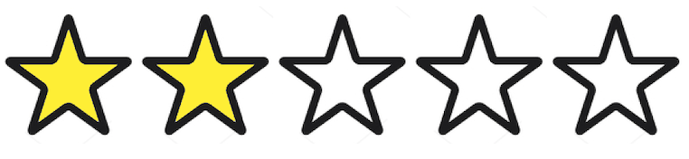

This document is in beta. Help us by [reporting issues via Github](https://github.com/jfhector/accessibility-guidelines) or [email](mailto:jeanfrancois.hector@googlemail.com).

[Back to the overview page](./../index.html)

# Non-text contrast

## Your page uses visual elements (like background colours or borders) to help users identify controls, their states, and understand infographics. &rarr; Make sure those visual elements have enough contrast.

---

On this page:

- [Requirements](#requirements)
- [Guidance for Design](#guidance-for-design)
- [More info](#more-info)

---

## Requirements

### For user interface components

- Visual information required to identify user interface components (like the border or background of a text input field), and what state they're in (like focused, or in error), must have a 3:1 contrast ratio against adjacent colors.

  - Except for
    - inactive components
    - if the appearance of the component is determined by the Operating System/Web Browser, and not modified

#### Common mistakes

- A text input field doesn't have border or background colour with enough contrast, so it's hard to see or understand that there is a text input.

- A text input's focus indicator doesn't have enough contrast, so it's hard for users to notice that the text input is selected.

##### Example: Link represented by an icon

##### OK

<figure>
  
  <caption>
It's clear that this icon represents Facebook, because the Facebook logo uses enough colour contrast.
</caption>
</figure>

##### Fail

<figure>
  
  <caption>
It's not visible enough that this icon represents Facebook, because the colour contrast between the green and the white is not sufficient.
</caption>
</figure>

### For graphical objects (like icons, or parts of an infographics)

- Any visual element that users need to see in order to understand the content of a page must have a 3:1 contrast ratio against adjacent colors.

#### Common mistakes

- The purpose and meaning of important images - like if a medicine is poisonous, or other warnings - are hard to see for a user who is sight impaired.

##### Example: star rating

###### OK

<figure>
  
  <caption>
The presence of the stars is indicated by their border, which is in black and has enough contrast with white.
</caption>
</figure>

###### Fail

<figure>
  
  <caption>
The presence of the stars is only indicated by their background colour, which doesn't have enough contrast with white.
</caption>
</figure>

### Why?

Many sight impaired users cannot see important controls or understand graphics if they have poor colour contrast.

### Official wording in the Web Content Accessibility Guidelines

> [**1.4.11 Non-text Contrast (Level AA):**](https://www.w3.org/TR/UNDERSTANDING-WCAG20/content-structure-separation-programmatic.html) The visual presentation of the following have a contrast ratio of at least 3:1 against adjacent color(s):
>
> - **User Interface Components**: Visual information required to identify [user interface components](https://www.w3.org/WAI/WCAG21/Understanding/non-text-contrast.html#dfn-user-interface-component) and [states](https://www.w3.org/WAI/WCAG21/Understanding/non-text-contrast.html#dfn-state), except for inactive components or where the appearance of the component is determined by the user agent and not modified by the author;
> - **Graphical Objects**: Parts of graphics required to understand the content, except when a particular presentation of graphics is [essential](https://www.w3.org/WAI/WCAG21/Understanding/non-text-contrast.html#dfn-essential) to the information being conveyed.

See the [W3C's detailed explanation of this guideline](https://www.w3.org/TR/UNDERSTANDING-WCAG20/content-structure-separation-programmatic.html) with techniques and examples.

---

## Guidance for Design

- Check that buttons or other inputs and controls have a ratio of 3:1 or higher. This also includes their 'state'.

  - This does not apply if inactive or if their look is made purely by the browser and not the author.

- Make sure parts of any graphics required to understand the content (like a warning icon) have good colour contrast.

### More guidance for design

- [Using an author-supplied, highly visible focus indicator](https://www.w3.org/WAI/WCAG21/Techniques/general/G195)
- [Focus Styles Frequently Asked Questions](https://docs.google.com/document/d/1I9AvA3cPDlNdNpBZ1Kotk0CRLjL4aNe5Fkjs6S61nBI/edit?usp=sharing) by Jean-Francois Hector
- [Ensuring that a contrast ratio of 3:1 is provided for icons](https://www.w3.org/WAI/WCAG21/Techniques/general/G207)
- Find out more about [Accessibility Requirements for People with Low Vision](http://w3c.github.io/low-vision-a11y-tf/requirements.html).

---

## More info

### Sources

- [W3C Web Content Accessibility Guidelines 2.1](https://www.w3.org/TR/WCAG21/)
- [Government Digital Service WCAG 2.1 Primer](https://alphagov.github.io/wcag-primer/)

### Contribute

This document is in beta. Help us by [reporting issues via Github](https://github.com/jfhector/accessibility-guidelines) or [email](mailto:jeanfrancois.hector@googlemail.com).
